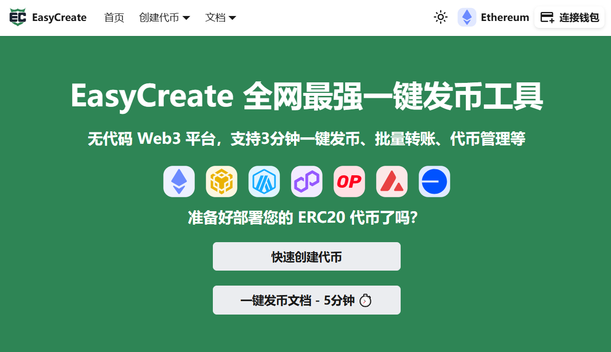

# EasyCreate 功能总览
EasyCreate全网最强一键发币工具，专注于EVM链（包括Ethereum、BSC、Polygon、Arbitrum、Optimism、Base），旨在满足快速增长的加密货币去中心化金融（DeFi）领域用户的需求。
EasyCreate提供可视化的界面，让用户能够快速创建、发行和管理自己的加密货币，而无需编写代码。此外，EasyCreate还提供一些附加功能，如生成代币合约地址靓号、批量生成账号及靓号地址、批量转账空投等，未来还将推出代币预售、代币锁定与解锁等多项服务。

**官网：** https://easycreate.org

**文档：** https://easycreate.org/docs/academy

##  **EasyCreate支持的EVM链包括 Ethereum、BSC、Polygon、Arbitrum、Optimism、Base**

### 💰代币工具
<table data-view="cards">
<tbody>
<tr><td><strong><a href="https://easycreate.org/app">🌕创建代币</a></strong></td><td>创建代币 | 一键发币 | 自定义名称\符号\数量 | 生成合约地址靓号</td></tr>
<tr><td><strong><a href="https://easycreate.org/Console">🌎管理代币</a></strong></td><td>代币信息 | 合约源代码 | 更改代币设置 | 权限控制 </td></tr>
<tr><td><strong><a href="https://easycreate.org/Console">🪂代币空投</a></strong></td><td>批量转账代币 | 快速分发 | 增加持币地址</td></tr>
</tbody>
</table>

### 💼附加工具
<table data-view="cards">
<tbody>
<tr><td><strong><a href="https://easycreate.org/createNewAdr">⚡批量创建钱包</a></strong></td><td>批量创建钱包地址 | 快速安全生成多账户</td></tr>
<tr><td><strong><a href="https://easycreate.org/createNewAdr">🌈生成靓号地址</a></strong></td><td>创建靓号钱包地址 | 打造独特身份标识</td></tr>
</tbody>
</table>

### 📚 EasyCreate文档
<table data-view="cards">
<tbody>
<tr>
<td><strong><a href="https://easycreate.org/docs/introduction">一键发币介绍</a></strong></td>
<td><strong><a href="https://easycreate.org/docs/tutorial_create">一键发币教程</a></strong></td>
</tr>
<tr>
<td><strong><a href="https://easycreate.org/docs/config">代币配置指南</a></strong></td>
<td><strong><a href="https://easycreate.org/docs/tutorial_liquidity">DEX上币教程</a></strong></td>
</tr>
<tr>
<td><strong><a href="https://easycreate.org/docs/burn_bonus">燃烧分红机制</a></strong></td>
<td><strong><a href="https://easycreate.org/docs/nosell">卖出限制功能</a></strong></td>
</tr>
<tr>
<td><strong><a href="https://easycreate.org/docs/open_source">合约开源教程</a></strong></td>
<td><strong><a href="https://easycreate.org/docs/chain_dex">各链DEX推荐</a></strong></td>
</tr>
<tr>
<td><strong><a href="https://easycreate.org/docs/fee">服务收费标准</a></strong></td>
<td><strong><a href="https://easycreate.org/docs/FAQ">常见问题FAQ</a></strong></td>
</tr>
<tr>
<td><strong><a href="https://easycreate.org/docs/declaration">服务条款 & 免责声明</a></strong></td>
<td><strong><a href="https://easycreate.org/docs/aboutUS/connectUS">联系我们 - 定制合约</a></strong></td>
</tr>
</tbody>
</table>

### 🏰 EasyCreate学院
<table data-view="cards">
<tbody>
<tr>
<td><strong><a href="https://easycreate.org/docs/academy/2048">《新人发币100问（从0到1学习代币创建）》</a></strong></td>
<td>从0到1创建加密货币的完整指南，让人人都是发币专家</td>
</tr>
<tr>
<td><strong><a href="https://easycreate.org/docs/academy/793">《代币营销宣传实战指南》</a></strong></td>
<td>技术决定下限，营销决定上限。好的营销、叙事、宣传、引流技巧，可以让代币项目迅速脱颖而出。</td>
</tr>
<tr>
<td><strong><a href="https://easycreate.org/docs/academy/795">《DEX流动性池概念解析》</a></strong></td>
<td>通过去中心化交易所流动性池，为代币定价并确保交易机制正常运转</td>
</tr>
<tr>
<td><strong><a href="https://easycreate.org/docs/academy/967">《税率vs滑点：发币项目方必懂的核心概念》</a></strong></td>
<td>什么是滑点？什么是税率？设置滑点与税率</td>
</tr>
<tr>
<td><strong><a href="https://easycreate.org/docs/academy/798">《币价涨跌的逻辑与市值计算的方法》</a></strong></td>
<td>币价与市值，短期看情绪，长期看价值</td>
</tr>
<tr>
<td><strong><a href="https://easycreate.org/docs/academy/792">《2026年还能在以太坊发币赚钱吗？》</a></strong></td>
<td>以太坊及BSC、ARB、Base链等活跃的 Layer 2 生态在 2026 年仍然是发行代币的顶级选择</td>
</tr>
<tr>
<td><strong><a href="https://easycreate.org/docs/academy/907">《EasyCreate无代码一键发币指南》</a></strong></td>
<td>EasyCreate的诞生标志着DeFi工具从“开发者专属”向“全民共创”的转型。</td>
</tr>
</tbody>
</table>

## 🔊 连接 EasyCreate 

* **📩 Email**：[easycreate5@gmail.com](gmail.com)

* **📚 官方文档**：[查看 EasyCreate 官方文档](https://easycreate.org/docs/introduction)

* **💬 技术支持**：[点击联络技术支持](https://t.me/easycreate17)

* **💻 GitHub**：[访问 GitHub 官方仓库](https://github.com/easycreate/docs/EasyCreateTool/readme.md)

EasyCreate 凭借多年行业经验，支持Ethereum、BSC、Polygon、Arbitrum、Optimism、Base等多公链部署，提供从代币创建、批量空投到代币管理的全链路工具，界面可视化，操作简单便捷，是目前区块链发币的最佳选择。

